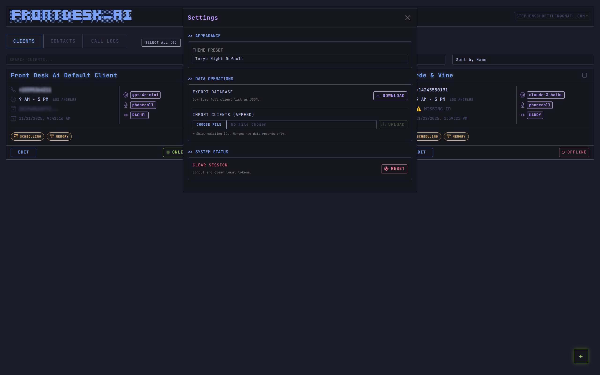

# 🤖 FrontDesk AI

[](LICENSE)
[](https://www.python.org/)
[](https://pipecat.ai/)

**FrontDesk AI** is an open-source, production-ready AI receptionist platform that answers phone calls, schedules appointments, and manages customer interactions 24/7. Built with Pipecat, it provides a complete multi-tenant SaaS solution with a beautiful web dashboard.

## ✨ Key Features

- 📞 **Real-time Voice Conversations** - Natural phone interactions powered by advanced AI
- 📅 **Smart Scheduling** - Automatic appointment booking via Google Calendar integration
- 🏢 **Multi-Client Support** - Manage multiple businesses from one dashboard
- 🔐 **Google OAuth Integration** - One-click calendar authorization
- 💳 **Built-in Billing** - Stripe integration with usage-based pricing
- 🎙️ **Dual TTS Options** - Choose between Cartesia (5x cheaper) or ElevenLabs
- 📊 **Real-time Call Dashboard** - Monitor active calls and view conversation logs
- 💬 **Conversation History** - Full transcripts stored and searchable
- 🔔 **Contact Management** - Automatic caller identification and history
- ⚡ **Production Ready** - Complete with authentication, authorization, and error handling

## 📸 Screenshots

| Dashboard | Client Management |
| :---: | :---: |
|  |  |

| Contacts | Call Logs |
| :---: | :---: |
|  |  |

| Settings |
| :---: |
|  |

## 🏗️ Architecture

**Core Stack:**
- **Orchestration:** [Pipecat](https://pipecat.ai/) - Real-time AI pipeline framework
- **Backend:** [FastAPI](https://fastapi.tiangolo.com/) + Python 3.11
- **Database:** [Supabase](https://supabase.com/) (PostgreSQL with Row Level Security)
- **Frontend:** Vue.js 3 with Bootstrap 5
- **Telephony:** [Twilio](https://www.twilio.com/) Voice WebSocket
- **Tunneling (Dev):** [ngrok](https://ngrok.com/)

**AI Services:**
- **LLM:** [OpenRouter](https://openrouter.ai/) (supports GPT-4o, Claude, Llama, Grok, etc.)
- **STT:** [Deepgram](https://deepgram.com/) Nova-2 (real-time transcription)
- **TTS:** [Cartesia](https://cartesia.ai/) Sonic-3 (default, $0.05/min) or [ElevenLabs](https://elevenlabs.io/) ($0.24/min)
- **Calendar:** [Google Calendar API](https://developers.google.com/calendar/api) with OAuth 2.0

**Payment Processing:**
- [Stripe](https://stripe.com/) - Subscription billing and usage tracking

## 🚀 Quick Start

### Prerequisites

- Python 3.11+
- Accounts for: Twilio, Supabase, Deepgram, Cartesia/ElevenLabs, OpenRouter, Google Cloud, Stripe
- ngrok (for development)

### 1. Clone and Install

```bash
git clone https://github.com/yourusername/frontdesk-ai.git
cd frontdesk-ai

# Create virtual environment
python -m venv venv
source venv/bin/activate  # On Windows: venv\Scripts\activate

# Install dependencies
pip install -r requirements.txt
```

### 2. Set Up Services

Follow the detailed setup guide in [docs/INSTALLATION.md](docs/INSTALLATION.md) to:
1. Create Twilio account and buy a phone number
2. Set up Supabase project and run migrations
3. Configure Google Calendar (OAuth or Service Account)
4. Get API keys for AI services
5. Set up Stripe for billing
6. Configure ngrok for development

### 3. Configure Environment

```bash
cp .env.example .env
# Edit .env with your API keys and credentials
```

See [docs/CONFIGURATION.md](docs/CONFIGURATION.md) for detailed environment variable documentation.

### 4. Run Database Migrations

```bash
# Install Supabase CLI
npm install -g supabase

# Run migrations
cd supabase
supabase db push
```

### 5. Start the Server

```bash
# Development mode
./start_server.sh

# Or manually
python main.py
```

The server will start on `http://localhost:8000`

### 6. Expose with ngrok

```bash
# In a new terminal
ngrok http 8000
```

Copy the https URL (e.g., `https://abc123.ngrok-free.app`) and configure it in Twilio as your webhook URL: `https://abc123.ngrok-free.app/voice`

### 7. Make a Test Call

Call your Twilio number - your AI receptionist will answer! 🎉

## 📚 Documentation

- [Installation Guide](docs/INSTALLATION.md) - Detailed setup instructions
- [Features Documentation](docs/FEATURES.md) - Complete feature breakdown
- [Architecture Overview](docs/ARCHITECTURE.md) - System design and components
- [API Reference](docs/API_REFERENCE.md) - REST API documentation
- [Configuration](docs/CONFIGURATION.md) - Environment variables and settings
- [Google Calendar Setup](docs/GOOGLE_CALENDAR_SETUP.md) - Calendar integration guide
- [Deployment Guide](docs/DEPLOYMENT.md) - Production deployment
- [Troubleshooting](docs/TROUBLESHOOTING.md) - Common issues and solutions
- [Contributing](CONTRIBUTING.md) - How to contribute

## 🎯 Use Cases

- **Medical Offices** - Schedule patient appointments, handle basic inquiries
- **Law Firms** - Initial client intake, consultation booking
- **Service Businesses** - Book service calls, answer common questions
- **Restaurants** - Reservation management, hours/menu information
- **Real Estate** - Property viewing appointments, inquiry handling
- **Any Business** - 24/7 phone coverage without hiring staff

## 🔒 Security Features

- **Row Level Security (RLS)** - Database-level access control
- **Encrypted Credentials** - AES encryption for OAuth tokens and service account keys
- **CSRF Protection** - State tokens for OAuth flows
- **JWT Authentication** - Secure user sessions
- **API Key Validation** - Protected endpoints with authentication
- **Audit Logging** - Complete conversation and action history

## 💰 Cost Optimization

FrontDesk AI is designed to be cost-effective:

- **Cartesia TTS** - Default option at $0.05/min (5x cheaper than ElevenLabs)
- **Deepgram Nova-2** - Affordable real-time STT at $0.0043/min
- **OpenRouter** - Access to cheaper models (Llama 3.1 70B at $0.35/$0.40 per 1M tokens)
- **Usage-Based Billing** - Clients only pay for minutes used
- **Efficient Architecture** - Minimal overhead, maximum performance

**Example costs for 1 hour of calls:**
- STT (Deepgram): $0.26
- TTS (Cartesia): $3.00
- LLM (Llama 3.1 70B): ~$0.50
- **Total: ~$3.76/hour** vs $14.40/hour with ElevenLabs

## 🧪 Testing

```bash
# Run unit tests
pytest

# Run with coverage
pytest --cov=services --cov-report=html
```

## 🤝 Contributing

We welcome contributions! Please see [CONTRIBUTING.md](CONTRIBUTING.md) for guidelines.

## 📝 License

This project is licensed under the MIT License - see the [LICENSE](LICENSE) file for details.

## 🙏 Acknowledgments

- [Pipecat](https://pipecat.ai/) - For the amazing real-time AI framework
- [Twilio](https://www.twilio.com/) - For reliable telephony infrastructure
- [Supabase](https://supabase.com/) - For the excellent PostgreSQL platform
- All the AI service providers making this possible

## 🔗 Links

- [Documentation](docs/)
- [Issue Tracker](https://github.com/yourusername/frontdesk-ai/issues)
- [Discussions](https://github.com/yourusername/frontdesk-ai/discussions)

## ⭐ Star History

If you find this project useful, please consider giving it a star! ⭐

---

**Built with ❤️ by developers who believe AI should be accessible to everyone.**
