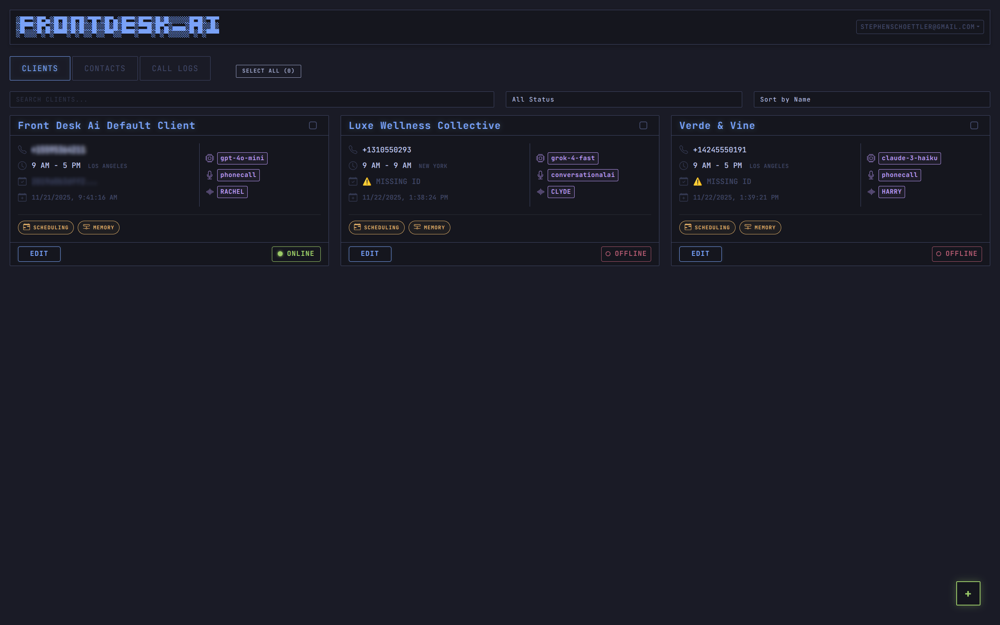
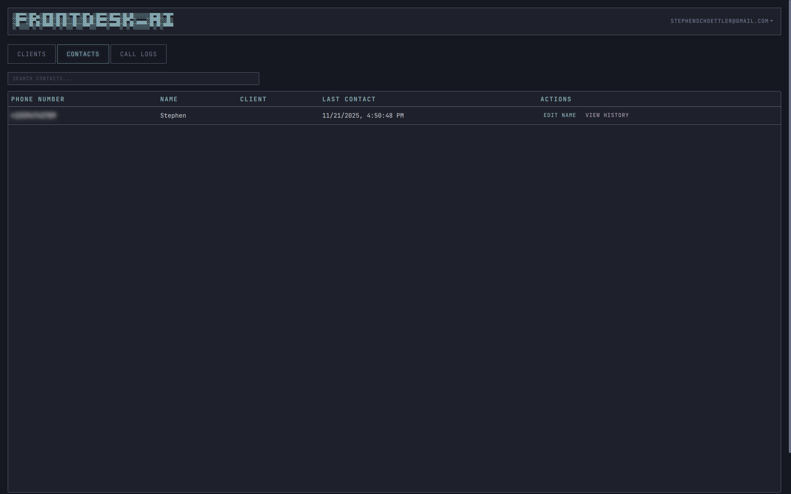
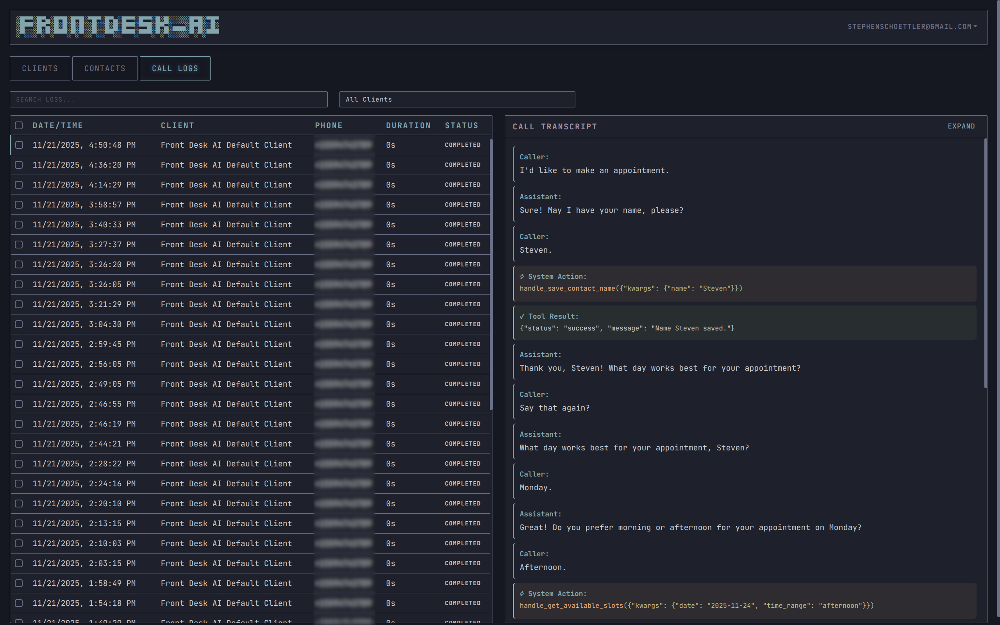

# Front Desk: AI Receptionist

[](LICENSE)
[](https://www.python.org/)

Front Desk is an open-source, real-time, conversational AI receptionist built to run on a local server. It uses Pipecat to orchestrate multiple AI services and connects to a public phone number via Twilio.

This project is designed to be a foundation for a fully-featured AI agent that can be customized to handle real-world business tasks, such as calendar management and lead capture.

## Table of Contents

- [Screenshots](#screenshots)
- [Core Tech Stack](#core-tech-stack)
- [Service Provisioning](#1-service-provisioning-the-gathering-phase)
- [Project Installation & Setup](#2-project-installation--setup)
- [Running the Receptionist](#3-running-the-receptionist)

## Screenshots

| Main | Edit Client |
| :---: | :---: |
|  |  |

| Contacts | Call Logs |
| :---: | :---: |
|  |  |

## Core Tech Stack

- **Orchestration:** [Pipecat](https://pipecat.ai/)
- **Web Server:** [FastAPI](https://fastapi.tiangolo.com/) & Uvicorn
- **Telephony:** [Twilio](https://www.twilio.com/) (Voice Webhooks)
- **Database:** [Supabase](https://supabase.com/) (Postgres)
- **Tunneling (Dev):** [ngrok](https://ngrok.com/)
- **AI Services:**
  - **LLM:** [OpenRouter](https://openrouter.ai/) (for access to Grok, Llama, GPT, etc.)
  - **STT:** [Deepgram](https://deepgram.com/) (Real-time transcription)
  - **TTS:** [ElevenLabs](https://elevenlabs.io/) (Real-time voice generation)
  - **Calendar:** [Google Calendar API](https://developers.google.com/calendar/api)

## 1. Service Provisioning (The "Gathering" Phase)

Before you can run this application, you must sign up for all of the following services and acquire the necessary API keys and credentials.

### ☐ 1.1. Twilio (The Phone Number)

1. **Create Account:** Sign up for a [Twilio](https://www.twilio.com/) account.
2. **Upgrade Account:** You **must** upgrade from a trial account by adding a payment method and a starting balance (e.g., $20). This is required to remove the "trial account" message from calls.
3. **Buy a Number:** Navigate to "Phone Numbers" → "Manage" → "Buy a number" and purchase a local number with **Voice** capability.
4. **Get Credentials:** From your main Account Dashboard, find and save your:
   - `TWILIO_ACCOUNT_SID`
   - `TWILIO_AUTH_TOKEN`
   - `TWILIO_PHONE_NUMBER` (the number you just bought, in +1... format)

### **☐ 1.2. Supabase (The "Memory")**

1. **Create Project:** Sign up at [Supabase](https://supabase.com/) and create a new project.  
2. **Get Credentials:** Go to your project's **Settings** \-\> **API**:  
   * Find the **Project ID** (e.g., your-project-id). Your URL is https://\[your-project-id\].supabase.co.  
   * Find the **anon public Key**.  
   * Save both for your .env file.  
3. **Create Tables:** Go to the **SQL Editor** in your project, paste the contents of `setup.sql` (located in the project root), and click **RUN**.

4. **Seed Default Data:** In the same **SQL Editor**, paste the contents of `seed.sql` (located in the project root), and click **RUN**.

See `setup.sql` in the project root for the SQL schema and `seed.sql` for default client data.

### **☐ 1.3. Google Calendar (The "Tool")**

1. **Create Project:** Go to the [Google Cloud Console](https://console.cloud.google.com/) and create a new project.  
2. **Enable API:** In "APIs & Services," enable the **Google Calendar API**.  
3. **Create Service Account:**  
   * Go to "Credentials" and create a **Service Account**.  
   * Select your new service account and go to its **KEYS** tab.  
   * Click **"ADD KEY"** \-\> **"Create new key"** \-\> **"JSON"** and download the file.  
4. **Save Key:** Place this JSON key file in your project directory (e.g., google-service-key.json).  
5. **Grant Permissions:**  
   * Open the JSON file and copy the client\_email address (e.g., ...gserviceaccount.com).  
   * Go to your Google Calendar settings and share your calendar with this email, granting it **"Make changes to events"** permissions.

### **☐ 1.4. AI Services (The "Brains")**

Sign up for the following services and get an API key from each:

* [**OpenRouter**](https://openrouter.ai/) (for the LLM)  
* [**Deepgram**](https://deepgram.com/) (for STT)  
* [**ElevenLabs**](https://elevenlabs.io/) (for TTS)

### **☐ 1.5. ngrok (The "Tunnel")**

1. **Create Account:** Sign up for a free account at [ngrok](https://ngrok.com/).  
2. **Get Authtoken:** Follow the "Getting Started" steps to get your authtoken.  
3. **Configure ngrok:** Authenticate your ngrok CLI (this is a one-time setup):  
   ngrok config add-authtoken <YOUR_NGROK_AUTHTOKEN>

## **2\. Project Installation & Setup**

1. **Clone the Repo:**  
   git clone \[https://github.com/your-username/frontdesk-ai.git\](https://github.com/your-username/frontdesk-ai.git)  
   cd frontdesk-ai

2. **Create Virtual Environment:**  
   python \-m venv venv  
   source venv/bin/activate

3. **Install Dependencies:**  
    pip install \-r requirements.txt  
    # For development  
    pip install pytest ruff

4. Create .env File:
   Copy the `.env.example` file to `.env`. This file will hold your secret keys.
   ```sh
   cp .env.example .env
   ```
   Next, open `.env` and fill it with all the credentials you gathered in Step 1.

## **3\. Running the Receptionist**

This requires two terminals running at the same time.

### **Terminal 1: Run the Server**

In your project directory, activate your environment and run the app:

source venv/bin/activate  
python main.py

The server is now running on http://localhost:8000.

### **Terminal 2: Run ngrok**

In a **new** terminal, start ngrok to expose your server to the internet:

ngrok http 8000

**Troubleshooting:** If Twilio fails to connect (you get an "application error" but see no traffic in your ngrok terminal), ngrok might have assigned you a URL that Twilio can't reach. Stop ngrok (Ctrl+C) and restart it using a different region to get a new URL:

ngrok http 8000 \--region eu

ngrok will give you a public "Forwarding" URL. Copy the https URL.  
Example: https://abcd-1234.ngrok-free.dev

### **Final Step: Configure Twilio**

1. Go to your **Twilio Console** \-\> **Phone Numbers** \-\> **Active numbers**.  
2. Click on your phone number.  
3. Scroll to the **"Voice Configuration"** section.  
4. Under **"A CALL COMES IN"**:  
   * Set the first dropdown to **"Webhook"**.  
   * In the URL box, paste your ngrok URL and add /voice at the end.  
   * **Full URL Example:** https://abcd-1234.ngrok-free.dev/voice  
   * Set the method to **HTTP POST**.  
5. Click **"Save"**.

### **You are LIVE.**

Call your Twilio number. Your AI receptionist will answer.

### Testing

Run unit tests:
```bash
pytest
```
This verifies that tool code is stripped from spoken responses.
